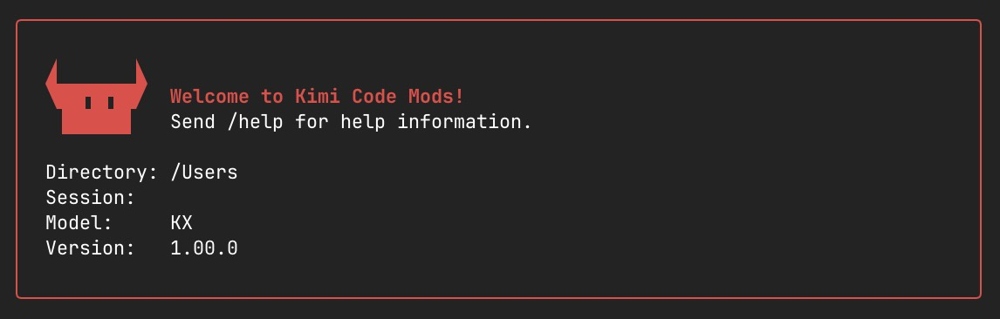
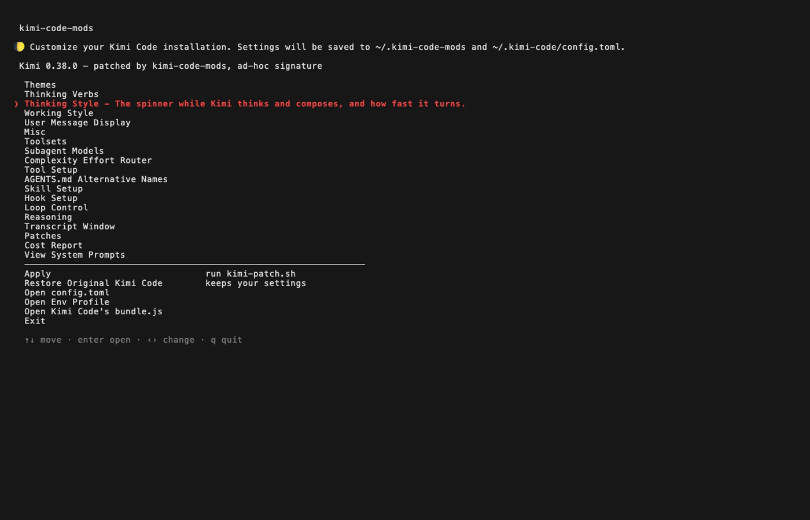

<div align="center">



# kimi-code-mods

[](https://github.com/Kirchlive/kimi-code-mods/releases)
[](#version-compatibility)
[](#behaviour)
[](#prompts)
[](#what-it-changes)
[](LICENSE)
[](#requirements)
[](#requirements)
[](#requirements)
[](#requirements)

**A terminal menu that patches your Kimi Code install — reasoning effort, the
tool catalogue, transcript window, system prompts, hooks and defaults, plus the
way it looks — and can always put it back.**

[Requirements](#requirements) · [Install](#install) ·
[What it changes](#what-it-changes) · [Undo](#undo) ·
[How it works](#how-it-works) · [FAQ](#faq) · [Internals](docs/internals.md)

</div>

---

Kimi Code ships as a single binary with its UI, prompts and defaults compiled
in. There is no settings file for most of it. `kimi-code-mods` opens that
binary, applies the changes you picked in a menu, and puts it back together —
starting from a pristine copy every time, so nothing accumulates and one
command undoes all of it.

<div align="center">



</div>

The header line is the state check: which Kimi is installed, whether this tool
patched it, and how it is signed. Everything above the divider is a setting —
[What it changes](#what-it-changes) goes through them. Below it are the
actions: **Apply** is the only row that reaches your Kimi at all,
**Restore Original Kimi Code** puts it back, and the three **Open** rows drop
you into Kimi's own `config.toml`, the `env-profile.conf` the launcher exports
its variables from, or the extracted `bundle.js` when you want to search for an
anchor yourself.

**At a glance**

| | |
|---|---|
| Verified against | Kimi Code **0.38.0** |
| Patches | **17** JavaScript patches over **25** settings |
| System prompts | **132**, extracted as Markdown |
| Tests | **29** checks, about 950 assertions |
| Patching | macOS only — the menu itself runs everywhere |
| Undo | one command, from a frozen pristine baseline |

## Requirements

| | Patching (**Apply**) | Menu | |
|---|---|---|---|
| **macOS** | ✅ | ✅ | Reads the Mach-O header of Kimi's binary and re-signs with `codesign`. |
| **Linux / WSL** | ❌ | ✅ | Apply refuses — the two steps above are macOS only. |
| **Windows** | ❌ | via WSL | The PowerShell installer sets things up inside WSL, with the same limit. |

Also needed: `python3` (menu), `node` (patch runner), `git`, and on macOS the
Xcode command line tools for `codesign`.

## Install

**macOS, Linux, WSL**

```sh
curl -fsSL https://raw.githubusercontent.com/Kirchlive/kimi-code-mods/main/install.sh | bash
```

**Windows (PowerShell)**

```powershell
iwr -useb https://raw.githubusercontent.com/Kirchlive/kimi-code-mods/main/install.ps1 | iex
```

<details>
<summary><b>Inspect before you run it</b> — recommended, this tool rewrites a binary</summary>

Piping a script into a shell means running code you have not read, and this one
goes on to modify an application you use. Download it first if that matters to
you:

```sh
curl -fsSL -o install.sh https://raw.githubusercontent.com/Kirchlive/kimi-code-mods/main/install.sh
less install.sh
bash install.sh
```

The installer itself touches no Kimi installation. It checks prerequisites,
puts the repository in `~/.kimi-code-mods`, and links `kimi-code-mods` into
`~/.local/bin`. Patching happens later, when you choose **Apply** in the menu.

</details>

<details>
<summary><b>From a checkout</b></summary>

```sh
git clone https://github.com/Kirchlive/kimi-code-mods.git ~/.kimi-code-mods
~/.kimi-code-mods/kimi-code-mods.sh
```

</details>

Then open the menu:

```sh
kimi-code-mods
```

Arrow keys move, `enter` opens, `‹›` change a value, `esc` goes back, `q`
quits. Nothing is written to Kimi until you pick **Apply**.

## What it changes

Every switch is on Kimi's own value until you change it. The menu writes to
`patch-settings.conf` and `~/.kimi-code/config.toml`; **Apply** is what reaches
the binary.

### The three that move cost

| Lever | What it does |
|---|---|
| **Transcript window** | How much history goes back with every turn. The one lever that moves running cost directly. |
| **Tool setup** | Every tool description ships in every request, so an unused tool is a tax on each turn. Turn tools off individually and see what the catalogue weighs. |
| **Reasoning** | How hard the model thinks, and whether thinking is re-sent with each turn. |

### Behaviour

| Group | What it does |
|---|---|
| **Complexity effort router** | `off` · `pin` · `free` — sets reasoning effort per turn from the prompt itself; `pin` only ever raises it, never lowers. |
| **AGENTS.md alternative names** | `off` · `claude` · `all` — have Kimi also read `CLAUDE.md` and friends. `AGENTS.md` keeps priority, one file per directory. |
| **Toolsets** | Named lists of disabled tools, applied in one keystroke, so a "minimal" and a "full" setup are one row apart. |
| **Subagent models** | Which model each subagent runs on. Needs Kimi's secondary-model flag. |
| **Skill setup** | Kimi's own product skills, and which directories skills are read from. |
| **Hook setup** | Run a shell command on any of Kimi's 20 events. |
| **Loop control** | Attempts per step, and how much context is held back for the answer. |
| **Patches** | The JavaScript patches themselves: what each one is, whether it applied, and what it did to the bundle. |

<details>
<summary><b>Misc</b> — the ten switches belonging to no group of their own</summary>

| Setting | Values | What it does |
|---|---|---|
| Command suggestions | `default` `half` `full` | Height of the slash-command list: Kimi's five, half the window, or nearly full. |
| Working directory /wd | `off` `on` | Adds a `/wd` command that starts a session in another directory. |
| Click to position cursor | `off` `on` | Place the cursor in the composer with a mouse click. Fullscreen only. |
| Line numbers in Read | `on` `off` | Off saves tokens on every read, and costs the model the ability to cite a line. |
| Expanded by default | `off` `thinking` `tools` `both` | Show thinking blocks and tool output unfolded. Costs screen, not tokens. |
| Read limits | `default` `moderate` `large` | How much one Read returns. Higher trades round trips for context. |
| Auto-accept plans | `off` `on` | Skip the plan approval prompt. A multi-option plan then has no option chosen. |
| Composer border | `default` `off` `single` `double` `bold` | The frame around the input box. |
| Fullscreen renderer | `off` `on` | The alternate screen buffer, patched into the binary so it holds however Kimi is started — not only through a launcher that exports an environment variable. |
| Welcome banner | `off` `on` | Greet with *Welcome to Kimi Code Mods!* and give the logo its horns. |

</details>

### Look

**Themes** — a palette editor over Kimi's 19 colour tokens with a live preview
of a session, and two presets that cannot be deleted: `Kimi-Code-Mods` (Kimi's
dark palette with the project red) and `Default Kimi`.

**Two spinners, settable apart** — the one turning while Kimi *thinks*, and the
one turning while it *waits* on the model or a tool. Kimi keeps two alphabets
and used to change both at once; here they are separate.

<details>
<summary><b>Spinners, verbs and message display</b> — every value</summary>

**Thinking style / Working style**

| Setting | Values |
|---|---|
| Spinner shape | `default` `braille` `dots` `moon` `blocks` `wave` `glow` `colors` `arc` `star` `custom` |
| Spinner speed | `default`, or 20–2000 ms per frame |
| Your own frames | any characters, space separated |
| Reverse-mirror run | `off` `on` — run the frames there and back, so it swings instead of jumping |

Working style takes the same presets plus `follow`, which keeps it equal to the
thinking spinner.

**Thinking verbs** — rotate a word beside the spinner instead of always saying
"working": on or off, your own word list, and the format they are drawn in.

**User message display**

| Setting | Values |
|---|---|
| Your message marker | any prefix; Kimi's own is a sparkle |
| Your message border | `off` `round` `single` `double` `bold` `topbottom` |
| Your message style | `default` `plain` `italic` `dim` `underline` `strikethrough` |

</details>

### Prompts

132 system prompts are extracted out of the binary into `system-prompts/`. Edit
one as plain Markdown and it replaces the original on the next run. A prompt
whose anchor moved in a Kimi release is reported and skipped, never guessed at.
**View System Prompts** reads them, prices them, and migrates your edits onto
the new text after a Kimi update.

**Cost report** — what every prompt weighs in tokens, so you can see what you
are paying for before you trim it.

## Undo

There are two, and neither depends on the other.

```sh
kimi-code-mods              # menu → Restore Original Kimi Code
~/.kimi-code-mods/kimi-patch.sh --restore
```

The first thing a patch run ever does is freeze an untouched copy of your Kimi
binary under `baseline/`. Every later run starts from that copy, not from the
patched one — so patches never stack, and restoring is a file copy rather than
an attempt to undo edits. Your settings survive a restore; only the binary goes
back.

To remove the tool itself:

```sh
rm ~/.local/bin/kimi-code-mods
rm -rf ~/.kimi-code-mods        # settings, baseline and patches live here
```

## What this costs you

> [!IMPORTANT]
> Re-signing is **ad-hoc**: the hardened runtime and Apple's notarisation are
> gone from the patched binary. That is inherent to modifying a signed
> application, not a shortcut taken here. If your setup requires a notarised
> Kimi, restore the baseline.

## How it works

Kimi Code is a Node single-executable application: a JavaScript bundle packed
into a Mach-O binary. A run is five steps, and stops at the first one that
fails without touching what is installed.

1. **Freeze** an untouched copy under `baseline/`, once per Kimi version.
2. **Extract** the ~22 MB bundle out of the baseline.
3. **Apply** your prompt overrides, then the patches in `patches/`. Each patch
   locates its anchor and refuses to act if the anchor is missing or ambiguous.
4. **Repack** the bundle and re-sign ad-hoc with `codesign`.
5. **Verify** the result runs and reports the expected version — and roll back
   to the baseline if it does not.

A run ends with a summary of what took, what had nothing to do, and what was
left behind:

```
 Apply summary

   patches   12 applied, 5 no-op, 0 failed
   prompts   0 applied, 132 unchanged, 0 drifted, 0 anchor missing, 0 rejected
   binary    repacked, re-signed ad-hoc, verified 0.38.0

   result    OK — Kimi Code 0.38.0 is patched and installed
```

Five of the seventeen patches are no-ops on this build: the setting they own is
still on Kimi's own value, so there is nothing to splice in. Turn one on and it
moves to *applied*.

Writing your own patch, the anchor rules, and how prompt extraction works are
in [docs/internals.md](docs/internals.md).

## Version compatibility

Verified against **Kimi Code 0.38.0**: all 17 patches and all 132 prompt
overrides find their anchor in this build.

Patches anchor on text inside a minified bundle, and that text moves between
releases. When an anchor is gone the patch reports it and is skipped — the run
carries on with the rest, and nothing half-applied is installed. Prompt
overrides work the same way: a prompt whose text Kimi rewrote is reported as
*anchor missing* on every run and left alone, rather than forced over the new
wording. `kimi-patch.sh --extract-prompts` pulls the new text out of the
updated binary, and `--migrate` three-way-merges your edits onto it.

Kimi replaces its own binary when it auto-updates, which removes every patch.
Your settings are untouched — run **Apply** again and they come back. To stop
Kimi updating itself:

```sh
export KIMI_CLI_NO_AUTO_UPDATE=1
```

The menu notices when the installed binary is no longer the one it patched and
says so in its header.

## FAQ

<details>
<summary><b>Kimi dies at startup with no message (exit 137).</b></summary>

macOS sends `SIGKILL` to a signed binary whose signature no longer matches its
contents. Every run re-signs ad-hoc for exactly this reason; if the binary was
edited by other means, restore the baseline and start again.

</details>

<details>
<summary><b>The menu runs but <i>Apply</i> refuses.</b></summary>

You are on Linux or WSL. Patching reads a Mach-O header and re-signs with
`codesign` — both macOS only. Everything else in the menu works.

</details>

<details>
<summary><b>Kimi updated itself and everything is stock again.</b></summary>

Expected: the update replaced the binary. Your settings survive — run **Apply**
again, or set `KIMI_CLI_NO_AUTO_UPDATE=1` to stop the updates.

</details>

<details>
<summary><b>A prompt reports "anchor missing".</b></summary>

Kimi moved that text in a release, so the override is skipped rather than
forced over the new wording. Nothing is lost. Re-extract with
`kimi-patch.sh --extract-prompts` and carry your change across with
`--migrate`, which does the three-way merge for you. See
[docs/internals.md](docs/internals.md).

</details>

<details>
<summary><b>Is it safe to run on the Kimi I use every day?</b></summary>

The patched build is verified before it is installed and rolled back if it does
not run, and the pristine binary is kept per version and never deleted. What
you do give up is notarisation — see
[What this costs you](#what-this-costs-you).

</details>

<details>
<summary><b>Can I write my own patch?</b></summary>

Yes — drop a `.js` file into `patches/`. The anchor rules, the runner contract
and the test harness are in [docs/internals.md](docs/internals.md).

</details>

## Tests

```sh
./test.sh          # unit checks, a few seconds
./test.sh --full   # adds the real binary: Mach-O resize, signing, round-trip
```

29 checks: the patch runner's contract, the auto-repatch guard, the launcher,
and the self-checks of every menu module (about 950 assertions in total),
including navigation driven through a real pseudo-terminal. The suite works on
copies and verifies at the end that it wrote to no real settings file.

## Prior art

[tweakcc](https://github.com/Piebald-AI/tweakcc) does this for Claude Code and
is where the idea came from — the marker, the bold-cyan selected row and the
preview-beside-the-list layout are all lifted from it. This is the same idea
pointed at a different binary, with a different container to open.

## License

MIT — see [LICENSE](LICENSE).
